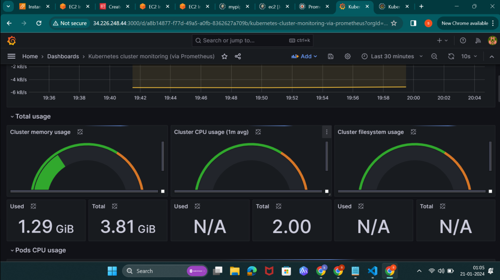

# Advanced End-to-End DevOps Project 

This repository contains an advanced end-to-end DevOps project that integrates various tools such as Git, Docker, Kubernetes, Helm, GitHub Actions, Jenkins, Terraform, Ansible, Prometheus, Grafana, AWS, and Shell scripts. The project sets up a continuous integration and deployment pipeline.

## Architecture Diagram


## Project Overview

### Step 1: Fork and Customize Repository

- Fork this repository and make any customizations if needed.

### Step 2: Set Up Jenkins Server on AWS EC2 Instance

- Create an EC2 instance on AWS with security group rules allowing ports 8080 and 50000.
- Install Docker on the instance.
- Configure Jenkins using the following command:
  ```bash
  docker run -d -v jenkins_home:/var/jenkins_home -p 8080:8080 -p 50000:50000 --restart=on-failure jenkins/jenkins:lts-jdk17
- Access Jenkins at http://<your-instance-ip>:8080, configure Jenkins, and install suggested plugins.

### Step 3: Configure Jenkins Worker Node
- Launch a second EC2 instance and configure it as a Jenkins worker node using the steps in the `JenkinsSlaveEc2Node` file.

### Step 4: Create Jenkins Pipeline
- Create a pipeline in Jenkins named "mypipeline" with the repository location and enable the webhook.

### Step 5 Configure GitHub Webhook 
- Add a webhook to your GitHub repository with the Jenkins URL: http://<your-jenkins-ip>:8080/github-webhook/.
- Select only the push event.

### Step 6 Configure DockerHub Credentials 
- As we are using GitHub Workflows for the Build, Testing, and publishing of my docker image, Hence we need to add DockerHub credentials to GitHub secrets with variables` DockerUsername` and `DockerPassword`.

### Step 7 Configure AWS Credentials
- Provide AWS credentials on the Jenkins slave node using _#awS configure_ or store them in Jenkins secrets, and then further add a step in `Jenkinsfile` to configure AWS credentials automatically. Terraform will use these credentials.

### Step 8 Run the Pipeline
- Trigger the pipeline in Jenkins and ensure all steps are executed correctly.

### Step 9 Make Changes and Test
- Make changes in your code locally, push to GitHub, and create a pull request.
- GitHub Actions will build, test, and push the Docker image.
- Merge the pull request to trigger the Jenkins pipeline, Which will deploy your app on top of k8s cluster

### Step 10: Jenkins Pipeline Stages
- Git
- Setup Ansible
- Setup Terraform
- Create Infrastructure for PROD
- Configure k8s cluster on the created infrastructure
- Configure Monitoring Tool
- Deploy the Webserver
- 

### Step 11: Access the Deployed Webserver
- Visit http://<your-Prodserver-ip>:8080 to see the deployed webserver.

### Step 12 Create a Socat for Prometheus and Grafana to access them from the internet: 
- Prometheus and Grafana servers are running they have been exposed also to the base system, but this k8s cluster we have created on AWS, So if you want to connect to these servers from the Internet(outside of your ec2 instance) you can create an extra socket(for my app webserver, I already did it with a shell script named `startservers.sh`) Simarly you can do for Prometheus and Grafana.
- `#sudo minikube service prometheus-server-ext` This command will show you on which NodePort this Server is been exposed.
- `#sudo socat TCP4-LISTEN:9090,fork,su=nobody TCP4:<minikube IP>:<Node Port> &` Now we have created a socket, So you can use the public IP of your ec2 server and access the Prometheus dashboard at port no 9090

Simarly we can do for Grafana

- `#sudo minikube service grafana-ext` - Get the NodePort
- `#sudo socat TCP4-LISTEN:3000,fork,su=nobody TCP4:<minikube IP>:<Node Port> &`

Get the Grafana dashboard at port no 3000 on your server

### Step 13 Create Grafana Dashboard: 
- Got to Grafana server - http://<your-Prodserver-ip>:3000
- Add the Prometheus datasource to grafana
- Visit [View Pre-Created Grafan Dashbords](https://grafana.com/grafana/dashboards/) to select a pre-created dashboard for monitoring the k8s server, you can copy that dashboard ID, and instead of creating the dashboard from scratch we can import a pre-created dashboard.
- Now you are good to go! Visualize your complete k8s cluster Now!

- 

Connect with me on LinkedIn in any kind of challenges - [Linkedin](https://www.linkedin.com/in/sudhanshu--pandey/)

